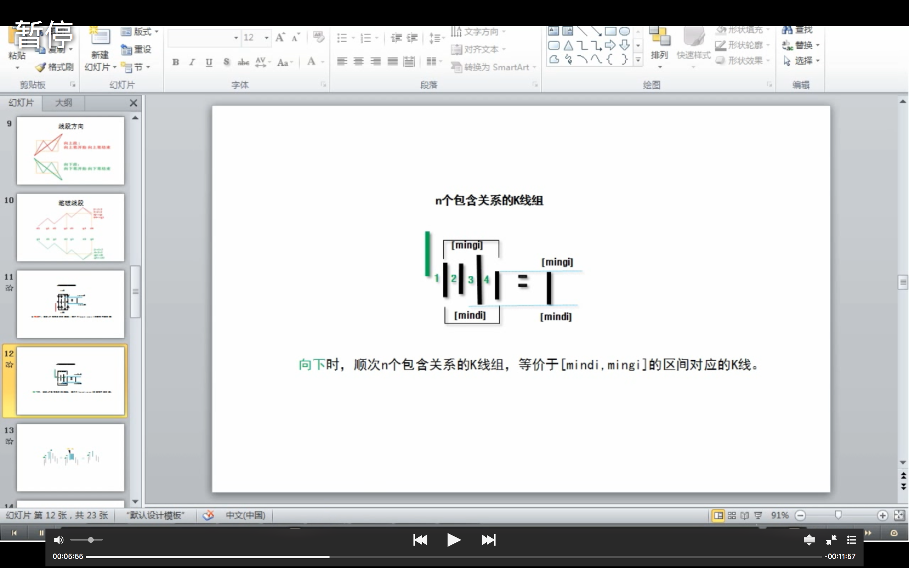
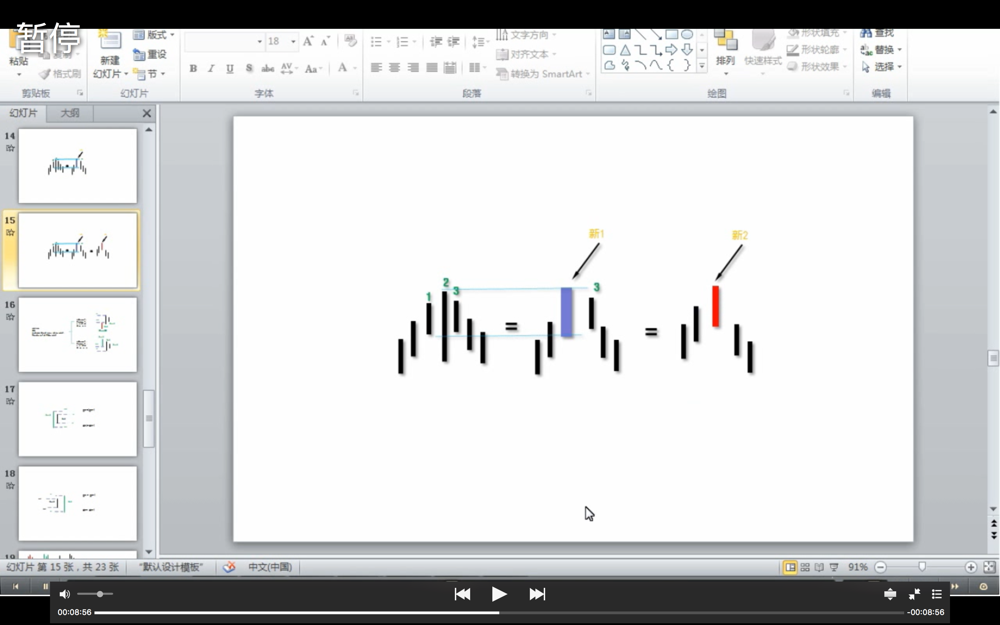
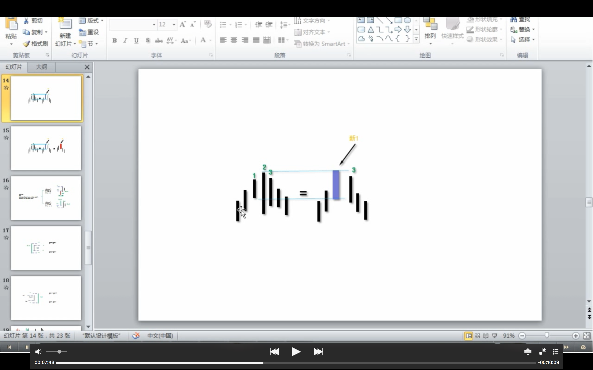
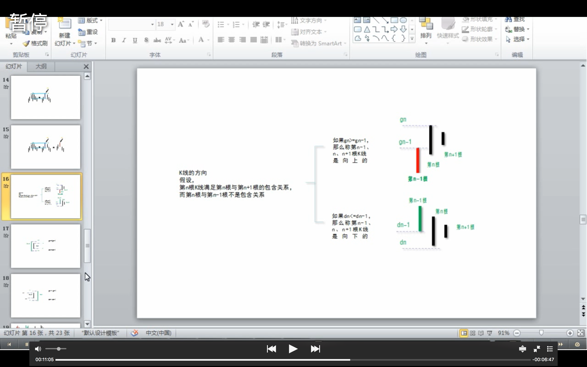
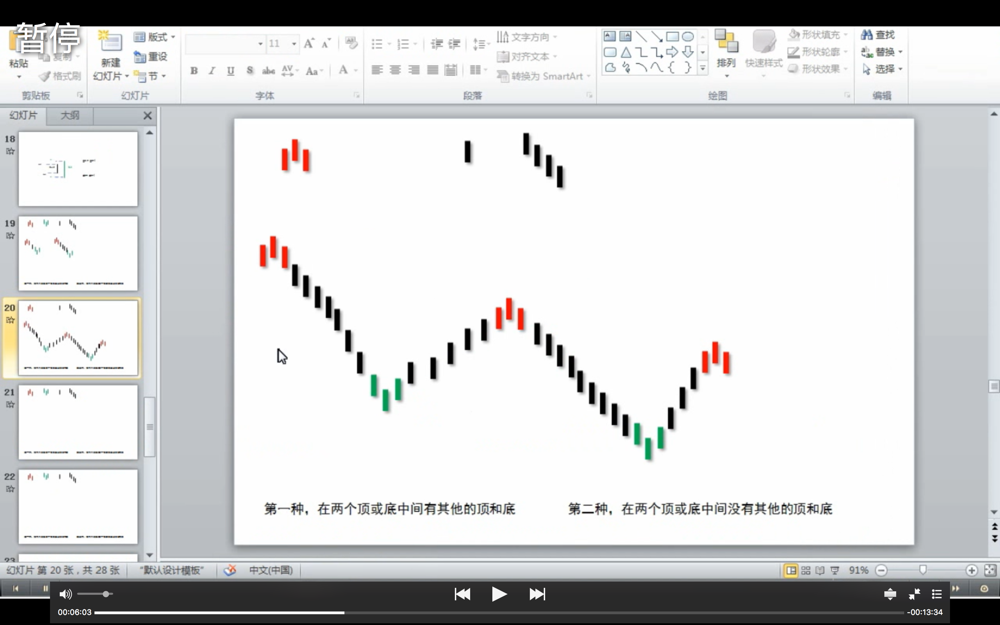
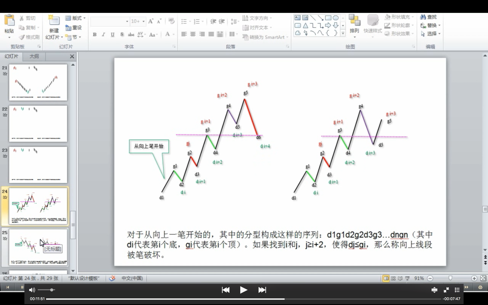
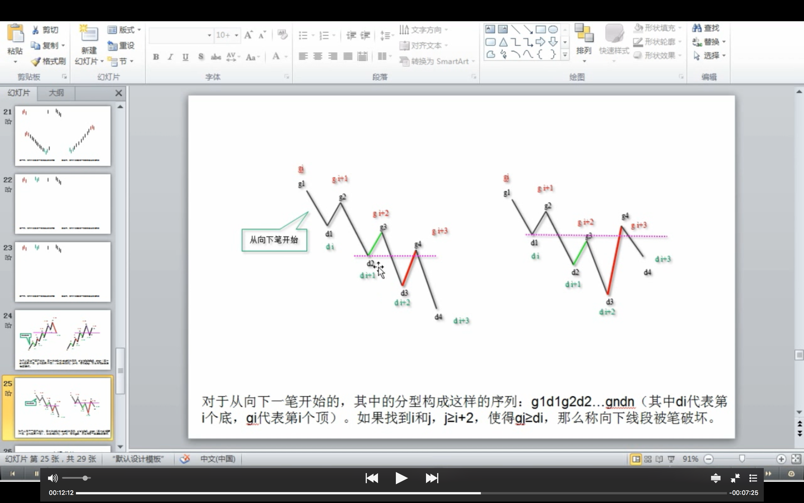

# 65.再说说分型、笔、线段

如果真明白了前面的，这课就不必再说了。**本ID反复强调，本ID理论的关键是一套几何化的思维**，因此，你需要 **从最基本的定义出发，而在实际操作的辨认中，这一点更重要**。**所有复杂的情况，其实，从最基本的定义出发，都没有任何的困难可言**。

---

例如，对于分型，里面最大的麻烦，就是所谓的前后K线间的包含关系，其次，有点简单的几何思维，**根据定义，任何人都可以马上得出以下的一些推论**：

**1、** 用[di,gi]记号第i根K线的最低和最高构成的区间，当向上时，顺次n个包含关系的K线组，等价于[maxdi,maxgi]的区间对应的K线，也就是说，这n个K线，和最低最高的区间为[maxdi,maxgi]的K线是一回事情；向下时，顺次n个包含关系的K线组，等价于[mindi,mingi]的区间对应的K线。
*（粗壮的种子：疑问。这里的“顺次n个包含关系的K线组”是有要求的，是什么？这个推论的基础是两个包含k线的处理规则。）*

**2、** 结合律是有关本ID这理论中最基础的，在K线的包含关系中，当然也需要遵守，而包含关系，不符合传递律，也就是说，第1、2根K线是包含关系，第2、3根也是包含关系，但并不意味着第1、3根就有包含关系。因此 **在K线包含关系的分析中，还要遵守顺序原则**，就是先用第1、2根K线的包含关系确认新的K线，然后用新的K线去和第三根比，如果有包含关系，继续用包含关系的法则结合成新的K线，如果没有，就按正常K线去处理。

*（粗壮的种子：疑问：结合律？35/36课有涉及）*

*（粗壮的种子：包含关系的处理规则：顺序原则）*

**3、** 有人可能还要问，**什么是向上？什么是向下？** 其实，这根本没什么可说的，任何看过图的都知道什么是向上，什么是向下。当然，本ID的理论是严格的几何理论，对向上向下，也可以严格地进行几何定义，只不过，这样对于不习惯数学符号的人，头又要大一次了。

假设，第n根K线满足第n根与第n+1根的包含关系，而第n根与第n-1根不是包含关系，那么如果gn>=gn-1，那么称第n-1、n、n+1根K线是 **向上的**；如果dn<=dn-1，那么称第n-1、n、n+1根K线是 **向下的**。

*（粗壮的种子：疑问：这里不可能有“=”的情况？缠师表述不够准确）*

---
有人可能又要问，如果gn<gn-1且dn>dn-1，算什么？那就是一种 **包含关系**，这就违反了前面第n根与第n-1根不是包含关系的假设。同样道理，gn>=gn-1与dn<=dn-1不可能同时成立。

*（粗壮的种子：疑问：如果是“=“的情况，算不算包含？62课也有这个疑问。解答：这种情况是包含关系，《热点蔓延，阳光下没有新鲜事》这篇回复中缠师有解答）*

*（粗壮的种子： **包含关系的几何定义** ：如果gn<=gn-1且dn>=dn-1或者如果gn>=gn-1且dn<=dn-1，《热点蔓延，阳光下没有新鲜事》这篇回复中缠师有解答）*

---
上面包含关系的定义已经十分清楚，就是一些最精确的几何定义，**只要按照定义来，没有任何图是不可以精确无误地、按统一的标准去找出所有的分型来。** 注意，**这种定义是唯一的，有统一答案的，就算是本ID，如果弄错了，也就是错，没有任何含糊的地方，是可以在当下或任何时候明确无误地给出唯一答案的，这答案与时间无关，与人无关，是客观的，不可更改的，唯一的要求就是被分析的K线已经走出来**。

*（粗壮的种子：只要按照定义来，在当下或任何时候都可以找出唯一答案的分型）*

---
从这里，本ID理论的当下性也就有了一个很客观的描述。为什么要当下的？因为如果当下那些K线还没走出来，那么具体的分型就找不出来，相应的笔、线段、最低级别中枢、高级别走势类型等就不可能划分出来，这样就无从分析了。**而一旦当下的K线走出来，就可以当下按客观标准唯一地找出相应的分型结构，当下的分析和事后的分析，是一样的，分析的结果也是一样的，没有任何的不同**。因此，当下性，其实就是本ID的客观性。

*（粗壮的种子：缠论的特点：当下性，客观性）*

---

有人可能要问，如果看30分钟图，可能K线一直犬牙交错，找不到分型。这有什么奇怪的，在年线图里，找到分型的机会更小，可能十几年找不到一个也很正常，这还是显微镜倍数的比喻问题。**确定显微镜的倍数，就按看到的K线用定义严格来，没有符合定义的，就是没有，就这么简单**。**如果希望能分析得更精确，那就用小级别的图，例如，不要用30分钟图，用1分钟图，这样自然能分辨得更清楚。** **再次强调，用什么图与以什么级别操作没任何必然关系，用1分钟图，也可以找出年线级别的背驰，然后进行相应级别的操作**。看1分钟图，并不意味着一定要玩超短线，把显微镜当成被显微镜的，肯定是脑子水太多了。

*（粗壮的种子：如果找不到分型，该如何做？答案在上面）*

*（粗壮的种子：不同的周期k线图（如1分钟/30分钟）的区别是什么？周期图越小，分析越精确越清楚）*

*（粗壮的种子：疑问：级别？用什么图与以什么级别操作没任何必然关系？答案在上面）*

---

从分型到笔，必须是一顶一底。那么，两个顶或底能构成一笔吗？这里，**有两种情况，第一种**，在两个顶或底中间有其他的顶和底，这种情况，只是把好几笔当成了一笔，所以只要继续用一顶一底的原则，自然可以解决；**第二种**，在两个顶或底中间没有其他的顶和底，这种情况，意味着第一个顶或底后的转折级别太小，不足以构成值得考察的对象，这种情况下，第一个的顶或底就可以忽略其存在了，可以忽略不算了。

*（粗壮的种子：这里参考韶山映山红的解释）*

---
所以，根据上面的分析，对第二种情况进行相应处理（类似对分型中包含关系的处理），就可以严格地说，先顶后底，构成 **向下一笔**；先底后顶，构成 **向上一笔**。**而所有的图形，都可以`唯一地`分解为`上下交替`的笔的连接**。显然，**除了第二种情况中的第一个顶或底类似的分型，其他类型的分型，都唯一地分别属于相邻的上下两笔，是这两笔间的连接**。用一个最简单的比喻，膝盖就是分型，而大腿和小腿就是连接的两笔。

*（粗壮的种子：笔的特点：所有的图形，都可以`唯一地`分解为`上下交替`的笔的连接）*

*（粗壮的种子：构成笔的分型的特点：唯一地分别属于相邻的上下两笔，是这两笔间的连接）*

---
有了笔，那么线段就很简单了，**线段至少有三笔，线段无非有两种**，从向上一笔开始的，和从向下一笔开始的。

对于从向上一笔开始的，其中的分型构成这样的序列：d1g1d2g2d3g3…dngn（其中di代表第i个底，gi代表第i个顶）。如果找到i和j，j>=i+2,使得dj<=gi,那么称 **向上线段被笔破坏**。

对于从向下一笔开始的，其中的分型构成这样的序列：g1d1g2d2…gndn（其中di代表第i个底，gi代表第i个顶）。如果找到i和j，j>=i+2,使得gj>=di,那么称 **向下线段被笔破坏**。

**线段有一个最基本的前提，就是线段的前三笔，必须有重叠的部分**，这个前提在前面可能没有特别强调，这里必须特别强调一次。线段至少有三笔，但并不是连续的三笔就一定构成线段，这三笔必须有重叠的部分。
*（粗壮的种子：线段：线段至少有三笔，且前三笔必须有重叠的部分）*

由上面线段被笔破坏的定义可以证明：

**缠中说禅线段分解定理**：线段被破坏，当且仅当至少被有重叠部分的连续三笔的其中一笔破坏。而只要构成有重叠部分的前三笔，那么必然会形成一线段，换言之，线段破坏的充要条件，就是被另一个线段破坏。
*（粗壮的种子：疑问：这里理解起来困难）*

以上，都是些最严格的几何定义，真想把问题搞清楚的，就请根据定义多多自己画图，或者对照真实的走势图，用定义多多分析。注意，所有分析的答案，只和你看的走势品种与级别图有关，在这客观的观照物与显微镜倍数确定的情况下，任何的分析都是唯一的，客观的，不以任何人的意志为转移的。

如果分型、笔、线段这最基础的东西都没搞清楚，都不能做到在任何时刻，面对任何最复杂的图形当下地进行快速正确的分解，说要掌握本ID的理论，那纯粹是瞎掰。
