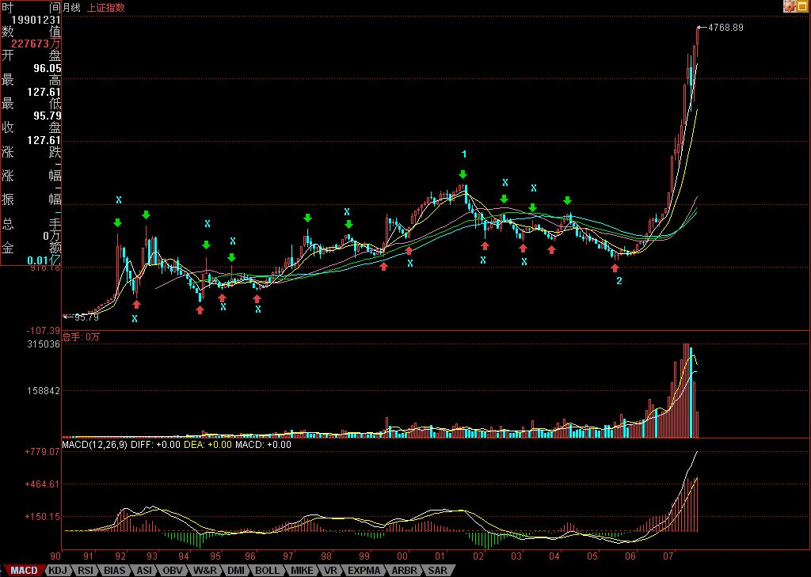
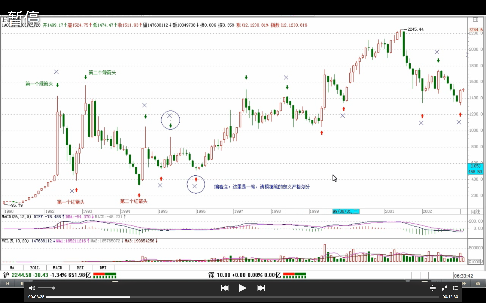
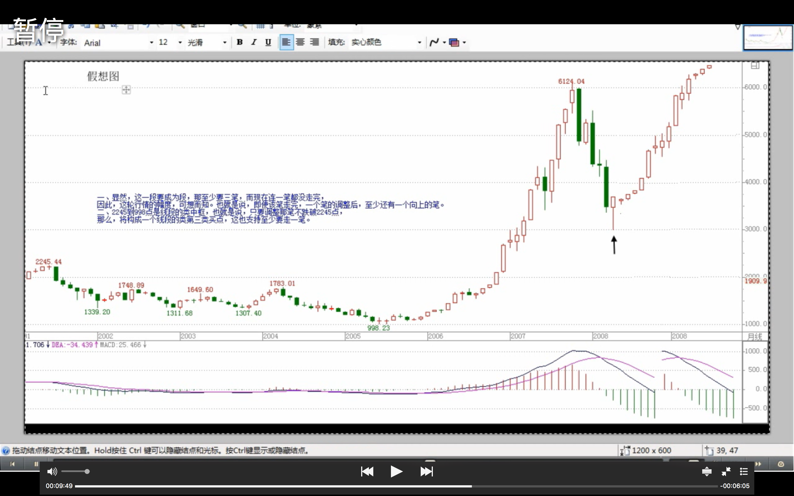
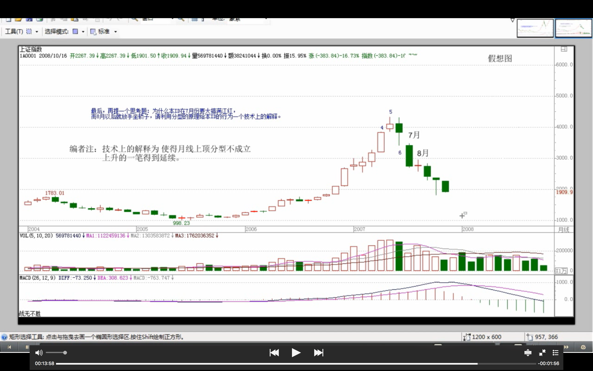

# 69.月线分段与上海大走势分析、预判

分型、笔、线段，在1分钟图上可以分辨，在月线图上的道理是一样的。**但用月线图分辨，等于用一个精度超低的显微镜，只能看一个大概，但这个大概，却是最实质性的，是一个大方向**。

下面，就是上海指数的月线图。绿箭头指着的是顶分型，红箭头的是底分型。打“X”的就是该分型不符合笔所要求分型的规范。这里，**主要是两条：一、顶和底之间有至少一K线；二、顶必须接着底、或底必须接着顶**。
*（粗壮的种子：疑问：“顶”“底”指的是顶分型/底分型，这里缠师表述不准确，之前有顶/底的定义指的是点）*

例如，第一个红箭头和第二个绿箭头之间显然不能构成一笔，也就是说，这两个，只能取一个：如果取第一个红箭头，那么第二个绿箭头就不是笔中分型，那么第二个红箭头，显然是一个底分型，因此，就形成两个底分型连续的划分，显然，这时候，第一个就不算了，这和前面说取第一个红箭头对着的底分型矛盾。所以，这里，只能取第二个绿箭头，这时候，第一个绿箭头对应的顶分型，自然就不算笔中的顶了。
*（粗壮的种子：疑问：第一个绿箭头和第二个红箭头构成一笔，这里的解释没懂）*

后面的各分型，带“X”的，都可以按照上面两个原则去分析。

*（粗壮的种子：疑问：缠师这里有错误，圈中的是一笔）*

有人可能要问，这样分型的确定，在当下如何完成？这必须当下去完成。例如，当走势走到第一个红箭头时，显然，第一绿箭头的顶分型也可以暂时看成是确定的顶分型。但当第二绿箭头走出来后，这个问题就有了可修改的地方。

有人可能要疑问，这样分型是否随时可以修改？答案是否定的。一旦完成的图形，这修改就不可能了。分型可修改，证明图形没完成。例如，当第二个红尖头分型出现后，前面三个的分型的取舍就是唯一的。这个分型的可修改性，反而是一个对走势判断极为有利的性质，例如，**第二个绿箭头走出来后，这图形未完成的性质就是百分百确定了，但所有图形必然完成，走势必完美**。如何才能完美，这样，在理论的框架下，只有极少的可能，而这些可能，就成为综合判断的关键条件。然后根据各级别图形的未完成性质，就可以使得走势的边界条件极端的明确与狭小，这对具体操作，就是极为有利的。注意，这可和概率无关，是百分百的纯理论保证，最终所依据的，就是在本ID理论最早反复强调的走势必完美原则。
*（粗壮的种子：疑问：这里理解起来困难）*

**其实，本ID的理论的关键不是什么中枢、走势类型，而是走势必完美，这才是本ID理论的核心**。但要真正理解这个关键，可不是看字面意思就能明白的。

显然，目前月线上的第1、2段已经走出来，其中，按照线段里笔的类背驰，1的结束那顶与2结束那底都是极为容易判断的。上海指数的历史大顶与底，根据这线段的划分，都不是什么难搞的秘密。那么，对现在依然进行中的第3段走势，有什么可百分百确定的呢？

*（粗壮的种子：疑问：如下图）*

一、显然，这一段要成为段，那至少要三笔，而现在连一笔都没走完，因此，这轮行情的幅度，可想而知。也就是说，即使该笔走完，一个笔的调整后，至少还有一个向上的笔。

二、2245到998点是线段的类中枢，也就是说，只要调整那笔不跌破2245点，那么，将构成一个线段的类第三类买点，这也支持至少要走一笔。
*（粗壮的种子：疑问：类中枢？线段的类第三类买点？）*

三、笔的完成，必须要构成一个顶分型。而一个月线的顶分型将如何构成？这意味着什么，这个问题就当成是一个作业，各位去思考一下，然后给出这个结论对应的操作策略。从中也可以亲自实践一下，去明白一下理论指导下操作的力量。

最后，再提一个思考题：为什么本ID在7月份要大搞满江红，而8月以后就放手坐轿子，请利用分型的原理给本ID的行为一个技术上的解释。

